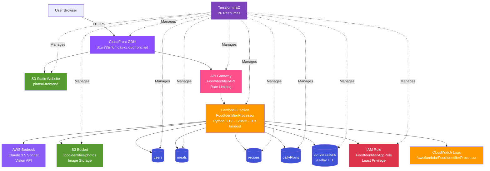

# PlateAI - AI-Powered Nutrition Tracking

Production serverless app using AWS Bedrock (Claude Vision) for photo-based meal tracking, AI recipe generation, and personalized nutrition coaching.

**Live Demo:** [plateai.cloud](https://plateai.cloud)  
**Infrastructure:** [plateai-terraform](https://github.com/AaronWhiteTX/Plateai-terraform)


---

## Architecture


---

## What It Does

- **Photo Analysis**: Upload food photos → AI identifies dish and calculates nutrition
- **Recipe Generation**: Get Vegan/Keto/Healthy alternatives for any meal
- **Meal Planning**: Plan daily meals with nutrition tracking
- **AI Coach**: Ask nutrition questions with conversation memory

---

## CI/CD Pipeline

Full CI/CD pipeline using GitHub Actions:

| Trigger | What Happens |
|---------|--------------|
| Push to main | Tests run, Frontend deploys to S3, Lambda updates, CloudFront cache clears |
| Pull request | Tests run only (no deploy) |

**Pipeline Steps:**
- Run pytest on Lambda function code
- Sync frontend files to S3
- Update Lambda function code
- Invalidate CloudFront cache

## Architecture Decisions

**Cost Optimization**
- DynamoDB on-demand: $0 cost when idle vs RDS $15/month minimum
- Lambda 128MB: Right-sized for workload, saves 75% vs default 512MB
- Rate limiting: Prevents runaway AI costs ($1-3/month vs $50-100 uncapped)
- S3 for photos: $0.023/GB vs storing base64 in database

**Performance**
- CloudFront CDN: Global edge caching for sub-100ms asset delivery
- DynamoDB: Single-digit millisecond queries
- Bedrock Claude 3.5: Sub-2-second AI responses through prompt optimization
- Lambda 30s timeout: Adequate for Bedrock API calls with retry logic

**Security**
- HTTPS enforced via CloudFront distribution
- IAM least privilege: FoodIdentifierAppRole grants only DynamoDB/S3/Bedrock access
- CloudWatch logging: All Lambda invocations logged for audit trail
- Input validation on all API Gateway endpoints

**Scalability**
- Lambda auto-scales: 0 to 1000+ concurrent executions
- DynamoDB on-demand: No capacity planning, scales with load
- CloudFront: Global edge network handles traffic spikes
- Serverless architecture: No servers to manage or patch

**Trade-offs Made**
- No WAF: Saves $5/month base cost, acceptable for portfolio project
- Logic-based rate limiting vs AWS WAF managed rules
- Standard encryption vs customer-managed KMS keys
- Would add for production: WAF, GuardDuty, advanced monitoring

---

## Tech Stack

**Backend**: Python 3.12, AWS Lambda, Boto3  
**AI**: AWS Bedrock (Claude 3.5 Sonnet with Vision API)  
**Storage**: 5 DynamoDB tables (on-demand), 2 S3 buckets  
**API**: API Gateway REST (FoodIdentifierAPI)  
**CDN**: CloudFront (d1ws39rn0mdavv.cloudfront.net)  
**IaC**: Terraform (26 resources)  
**CI/CD**: GitHub Actions  
**Monitoring**: CloudWatch Logs

---

## Infrastructure Resources

**Compute**
- Lambda: FoodIdentifierProcessor (Python 3.12, 128MB, 30s timeout)
- IAM: FoodIdentifierAppRole (least privilege permissions)

**Storage**
- DynamoDB: users, meals, recipes, dailyPlans, conversations (90-day TTL)
- S3: plateai-frontend-730980070158 (static site), foodidentifier-730980070158-photos (images)

**Networking**
- API Gateway: FoodIdentifierAPI (s8w5yfkidb)
- CloudFront: E2D4G621UQDPM6 (global CDN)

**Monitoring**
- CloudWatch: /aws/lambda/FoodIdentifierProcessor (execution logs)

---

## Key Stats

- **Response Time**: Sub-2-seconds for AI operations
- **Monthly Cost**: $1-3 (engineered for cost efficiency)
- **Availability**: 99.9%+ (serverless inherent reliability)
- **Infrastructure**: 26 AWS resources, 100% Terraform-managed
- **Deployment**: Automated via GitHub Actions CI/CD

---

## Quick Start
```bash
git clone https://github.com/AaronWhiteTX/Plateai-terraform
cd Plateai-terraform
terraform init
terraform apply

terraform destroy
```

Full deployment guide: [DEPLOYMENT.md](DEPLOYMENT.md)

---

## What This Demonstrates

**Cloud Engineering**
- Production serverless architecture (Lambda, DynamoDB, S3, API Gateway, CloudFront)
- Multi-service AWS integration across compute, storage, networking, AI
- Infrastructure as Code with Terraform (import, provision, teardown)

**CI/CD and DevOps**
- Full CI/CD pipeline with GitHub Actions
- Automated testing with pytest
- Automated deployment to S3 and Lambda
- CloudFront cache invalidation for instant updates

**AI/ML Integration**
- AWS Bedrock Claude 3.5 Sonnet Vision API for image recognition
- Prompt engineering for structured nutritional outputs
- Context management for conversational AI with DynamoDB persistence

**Cost & Operations**
- FinOps: Architected for sub-$5/month operation through resource right-sizing
- CloudWatch logging for observability and debugging
- Rate limiting prevents cost overruns from AI API usage

**Security & Reliability**
- IAM least privilege (FoodIdentifierAppRole)
- HTTPS enforcement via CloudFront
- Multi-AZ deployment (DynamoDB, Lambda)
- CloudWatch audit logging

---

**Status**: Live in production at plateai.cloud  
**Monthly Cost**: $1-3  
**Completed**: November 2025 
**Region**: us-east-1

---

**Built with AWS | Managed with Terraform | Deployed with GitHub Actions**
