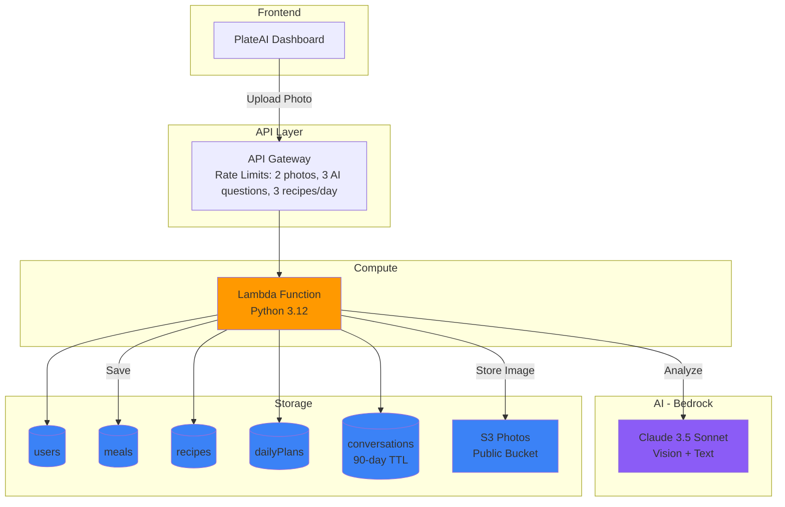

# PlateAI - AI-Powered Nutrition Tracking & Meal Planning

A production-grade serverless web application that uses AWS Bedrock (Claude AI) to identify foods from photos, generate healthy recipe alternatives, track nutrition, and provide personalized meal planning.

**Live Demo:** [plateai.cloud](https://plateai.cloud)

---

## System Architecture


## Project Overview

PlateAI solves the problem of manual food logging and meal planning by leveraging Generative AI for image recognition and nutritional context.

**Core Functions:**
- **Photo-to-Nutrition**: Upload a food photo to have Claude Vision identify the dish and estimate macros.
- **Recipe Generation**: Get Vegan, Keto, or Healthy alternatives for any meal with AI-generated recipes.
- **Daily Meal Planner**: Plan meals for any date with nutrition tracking and goal monitoring.
- **AI Coach**: Ask nutrition questions with full conversation context preserved.
- **Meal History**: Save meals and recipes for quick future planning.

**Key Stats:**
- **Monthly Cost**: ~$1-3 (optimized via strict rate limiting)
- **Latency**: <2 seconds for most requests
- **Rate Limits**: 2 photos, 3 AI questions, 3 recipes per day (implemented for cost protection)

---

## Infrastructure as Code

The **entire live production stack** (26 AWS resources) is fully managed with Terraform:
- Lambda function, 5 DynamoDB tables, 2 S3 buckets, API Gateway, CloudFront, IAM roles, ACM certificate
- Imported from running production app (zero downtime, zero changes applied)
- Automated deployment script for one-command infrastructure provisioning
- Complete teardown capability for cost control

**Terraform Repository:** [plateai-terraform](https://github.com/AaronWhiteTX/Plateai-terraform)

This demonstrates:
- Infrastructure as Code best practices
- Ability to import and manage existing production environments
- Separation of application code from infrastructure definitions
- Reproducible deployment workflows

---

## Cost Protection & Rate Limiting

To maintain a low-cost serverless footprint, strict logic controls usage frequency per user.

**Daily Limits (per user)**
- 2 photo uploads per day
- 3 AI coach questions per day
- 3 recipe generations per day
- Limits reset automatically at midnight
- State stored in localStorage with backend validation

**Cost Implications**

Per user (at limit):
- 2 photos x $0.015 = $0.03
- 3 AI questions x $0.009 = $0.027
- 3 recipes x $0.03 = $0.09
- **Total**: Approx $0.15 per user/day at max capacity.

Without limits: Heavy usage could spike costs to $50-100/month. The current implementation ensures the project remains within the $1-3/month range for portfolio demonstration purposes.

---

## Key Features & Data Flow

### 1. Food Photo Analysis

The system uses S3 for persistent image storage and Bedrock for analysis.

**Data Flow:**
User upload -> Lambda (base64) -> S3 (Storage) -> Bedrock Claude Vision -> DynamoDB

**Analysis Response Example:**
```json
{
  "dish_name": "Pecan Pie Slice",
  "confidence": 0.95,
  "calories": 450,
  "protein_g": 5,
  "carbs_g": 45,
  "fat_g": 28,
  "fiber_g": 2,
  "photo_url": "https://s3.amazonaws.com/..."
}
```

### 2. AI Recipe Generation

Generates healthier alternatives for any analyzed meal (Vegan, Keto, Healthy, or Original). Recipes are auto-saved to history with photo references.

### 3. AI Coach with Context

The system queries conversation history from DynamoDB before calling Bedrock, allowing Claude to respond naturally to follow-up questions. Conversations have a 90-day TTL.

---

## Technical Decisions

### Why Bedrock Claude?
- **Vision API**: Native ability to analyze food photos.
- **Context Windows**: Handles conversation history for the AI coach.
- **Pay-per-token**: No fixed costs (unlike provisioned instances), making it ideal for variable traffic.

### Why DynamoDB?
- **On-demand billing**: Costs are zero when traffic is low.
- **TTL**: Automatic cleanup of old conversation logs reduces storage costs.
- **Performance**: Single-digit millisecond latency for user queries.

### Why S3 for Photos?
- **Persistence**: More efficient than storing base64 strings in a database.
- **Public Access**: Easy integration with the frontend via direct URLs.
- **Cost**: Significantly cheaper storage ($0.023/GB) compared to database storage.

---

## Security & Limitations

### Implemented Security
- **HTTPS**: Enforced via API Gateway and CloudFront.
- **Input Validation**: Strict type checking on photos and text inputs.
- **Rate Limiting**: Logic-based daily limits to prevent abuse.
- **Data Hygiene**: Password hashing (SHA-256) and CORS configuration.

### Known Gaps & Cost Trade-offs

To keep the monthly operating cost of this portfolio project under $5, the following trade-offs were made:

- **WAF (Web Application Firewall)**: Omitted to avoid the fixed monthly fee (approx. $5/rule/month).
- **Encryption at Rest**: Standard AWS managed encryption is used. Customer-managed keys (KMS) were not implemented to avoid key management costs.
- **Request Signing**: The architecture relies on API Gateway keys and logic-based rate limits rather than signed requests to simplify the frontend demonstration.

---

## API Architecture

The application exposes a RESTful API via AWS API Gateway.

| Endpoint | Method | Description |
|----------|--------|-------------|
| `/analyze_food_photo` | POST | Accepts base64 image, returns dish name and macros. |
| `/generate_recipe` | POST | Generates diet-specific recipe variants (Keto, Vegan, etc). |
| `/save_meal` | POST | Saves analyzed food data to DynamoDB. |
| `/get_meals` | POST | Retrieves meal history by UserID. |
| `/save_plan` | POST | Saves a daily meal plan structure. |
| `/get_plan` | POST | Retrieves meal plan for a specific date. |

---

## Deployment

See [DEPLOYMENT.md](DEPLOYMENT.md) for complete instructions on deploying PlateAI to your own AWS account.

Quick overview:
1. Enable Bedrock Claude access in AWS
2. Clone repositories (app + Terraform)
3. Configure bucket names and optional custom domain
4. Deploy infrastructure: `terraform apply`
5. Upload frontend files to S3

Full teardown: `terraform destroy` (complete cleanup, zero residual cost)

---

## Portfolio Competencies

This project demonstrates the following engineering capabilities:

- **Cloud-Native Development**: Multi-service integration (Lambda, Bedrock, DynamoDB, S3, API Gateway).
- **Infrastructure as Code**: Complete production environment managed via Terraform with automated deployment.
- **FinOps & Cost Awareness**: Engineering architectural decisions specifically to control cloud spend (rate limits, resource selection).
- **Production Readiness**: Implementation of error handling, input validation, and TTL data cleanup.
- **AI Integration**: Applied usage of Vision and LLM models in a practical, user-facing context.
- **Full Stack Implementation**: Complete development from backend Python logic to frontend integration.
- **DevOps Practices**: Separation of infrastructure and application code, reproducible deployments, automated teardown.

---

**Last Updated**: November 30, 2025 
**Status**: Production-Ready  
**Monthly Cost**: $1-3 (with rate limits)
